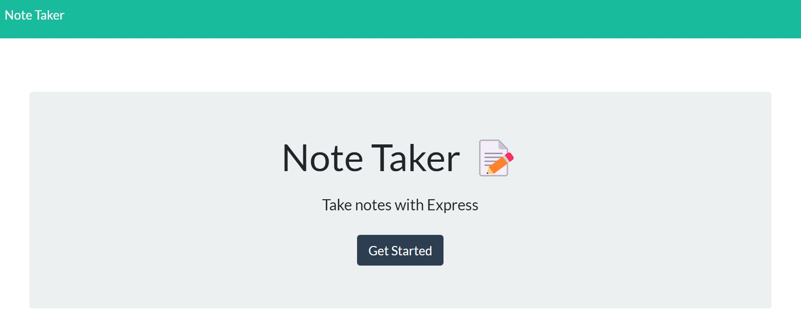

# Express Note Taker

## Table of Contents

* [Description](#description)
* [Installation](#installation)
* [Usage](#usage)
* [Contributing](#contributing)
* [License](#license)
* [Questions](#questions)

## Description

*Built using:*
- Node.js®
- Express.js
- JavaScript
- HTML
- CSS

This website can be used to take quick notes of ideas to remember or tasks to do. The notes are saved in JSON format on the db.json file. The application is set up to allow a user to add a new note or to delete a note from the database from the webpage user interface.

## Installation

*To set up this file locally...*

 - Clone this repo to your computer
 - Run `npm i` to install the dependencies

## Usage

To start the application: `node server`

You will see a note in the command line stating `API server now on port 3001!`

On your default browser, navigate to [localhost:3001](localhost:3001). *Google Chrome is recommended*.

Click "Get Started" to begin using the application to view, add, or delete notes. 

## Contributing

Starter code for this application provided by [The Coding Bootcamp](https://github.com/coding-boot-camp/miniature-eureka).

If you would like to contribute to this project, submit a **pull request** or reach out directly via **email** linked below.

## License

Copyright © 2022 Christine Diienno

This project is licensed under the [MIT License](https://mit-license.org/).

## Questions

Do you have any questions? 

You can find my github profile here: [mrsdno](https://github.com/mrsdno)

Or you can email me here: [christine@dno.dev](mailto:christine@dno.dev)
